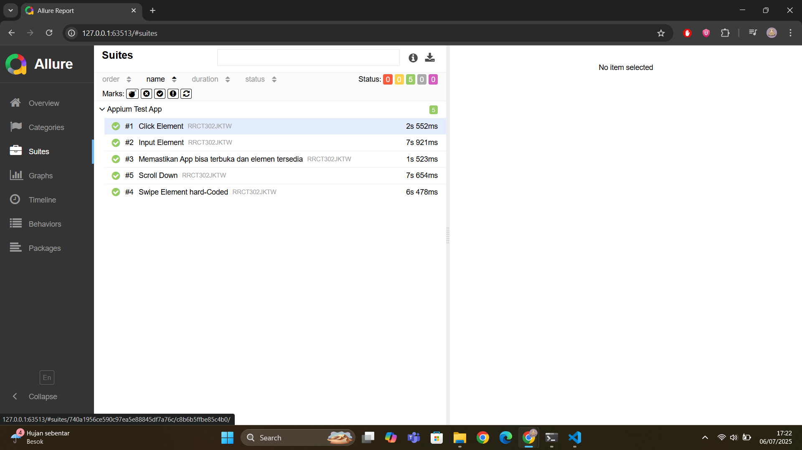

# 🧪 Apiium App Automation Test

Project ini adalah bagian dari **Digital Skola kelas QA Engineer batch 10**.  
Dalam project ini berisikan **automation testing** pada aplikasi [API DEMOS](https://github.com/appium/appium/tree/master/packages/appium/sample-code/apps) menggunakan **Appium** dan **Chai** sebagai framework testing, dengan fokus pada fungsionalitas pad aplikasi Android.

---

## 📦 Teknologi yang Digunakan

- ✅ **Node.js** – Runtime JavaScript untuk menjalankan proyek.

- ✅ **Appium** – Framework open-source untuk automation testing pada aplikasi mobile.

- ✅ **Appium Inspector** – Alat bantu GUI untuk mengeksplorasi elemen UI dari aplikasi mobile.  
  🔗 [Download Appium Inspector](https://github.com/appium/appium-inspector/releases)

- ✅ **WDIO (WebdriverIO)** – Framework test runner yang digunakan untuk menjalankan automation script.

- ✅ **Chai** – Library assertion BDD/TDD yang digunakan dalam pengujian.

- ✅ **Allure** – Framework pelaporan hasil pengujian berbasis UI yang interaktif.

---

## 🧪 Daftar Pengujian

| No | Nama Test                                  | Deskripsi                                                                 |
|----|--------------------------------------------|---------------------------------------------------------------------------|
| 1  | `Click Element`                            | Menekan menu "Accessibility" pada tampilan utama aplikasi                 |
| 2  | `Input Element`                            | Mengisi field username dan password pada dialog input                     |
| 3  | `Memastikan App bisa terbuka`              | Memverifikasi bahwa elemen utama tampil setelah aplikasi dibuka          |
| 4  | `Swipe Element hard-Coded`                 | Melakukan swipe horizontal pada galeri foto menggunakan gesture manual    |
| 5  | `Scroll Down`                              | Melakukan scroll ke bawah hingga menemukan elemen "Layouts" dan mengkliknya |

---

## ▶️ Cara Menjalankan

### 1. Install dependensi:
```bash
npm install
```

### 2. Menjalankan automation test menggunakan konfigurasi wdio.conf.js.
```bash
npm run test
```

### 3. Menghasilkan laporan Allure berdasarkan hasil pengujian.
```bash
npm run allure:generate
```

### 4. Membuka laporan Allure dalam browser.
```bash
npm run allure:open
```
---

## 📊 Hasil Test Report (Allure)

Berikut adalah **hasil report** dari pengujian otomatis:




---

## 👨‍💻 Author

Rifqi Abdillah – [GitHub](https://github.com/rfqabdillah)